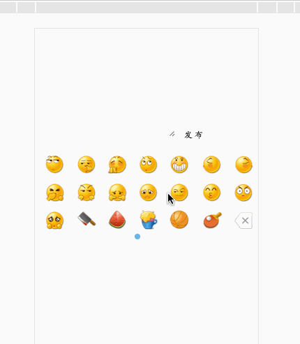

[]()

```
1.script

    <link type="text/css" rel="stylesheet" href="./css/face.css">
	<script type="text/javascript" src="./dist/face.min.js"></script>

 var face=new Face({
         elemObj: document.getElementById('text'),
         emojiBox: document.getElementById('emoji-box')
     });
   face.init();
   document.getElementById('release').onclick=function () {
       document.getElementById('text-show').innerHTML=face.compileFace(document.getElementById('text').value);
   }
  
 2. amd cmd
	 require("emoji-face")
 	 import Face from 'emoji-face'
 	
```
  
  
# emoji-faces-wx
wechat emoji face / 微信表情

